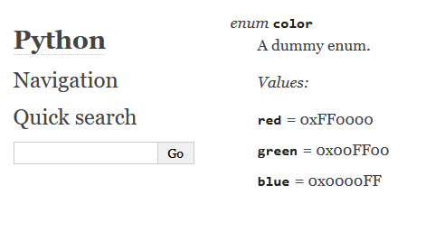
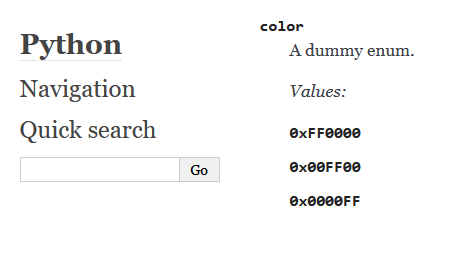

Breathe C domain issue
======================

Minimal repo to reproduce a problem with breathe v4.12+ with C domain.

When run, this example should generate a website with the following output:

When using breathe v4.12+, the result is this instead:

